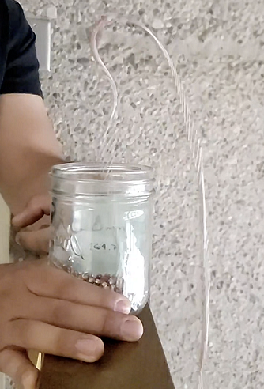
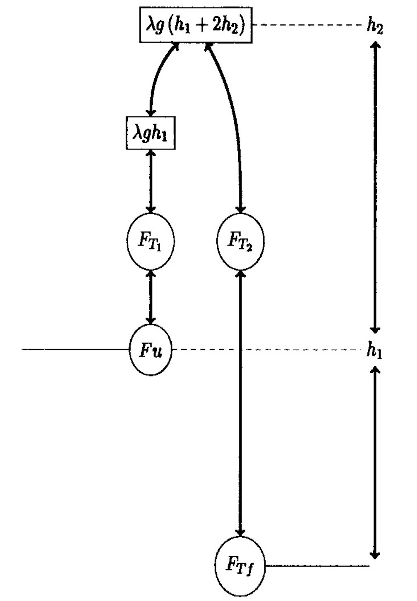
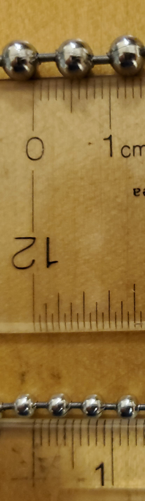
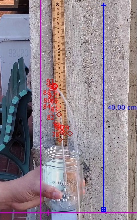
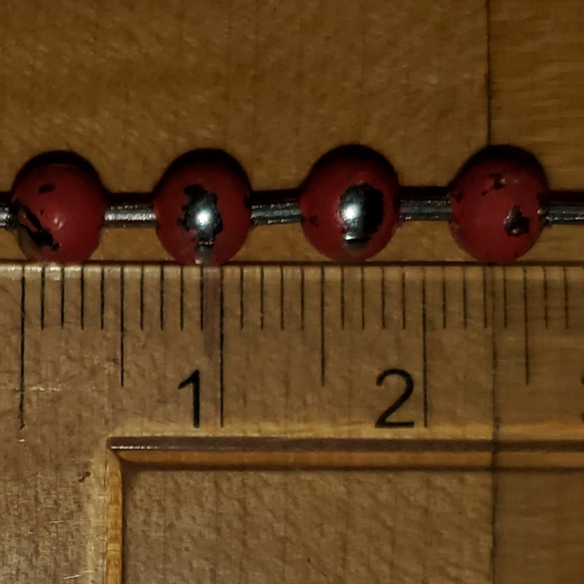
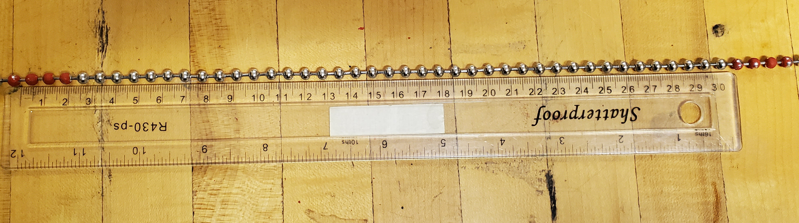
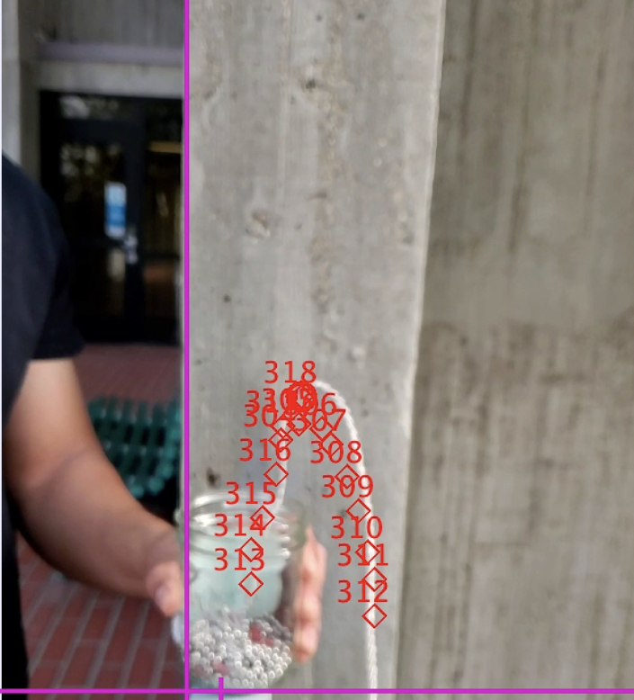

## Abstract

A chain at rest, at initial height $h_{1}$ is released from the edge of a beaker and begins to fall. It is observed that the chain begins to rise to a distance $h_{2}$, forms a circular arc, and it's velocity constantly increase. There exist a constant ${\alpha }$, of proportionality between $h_{1}$ and $h_{2}$. The magnitude ${\alpha }$ is proportional to the square root of the velocity. There is a linear relation between ${\alpha }$ and $h_{2}$ for values of $h_{1}$ less than 3.0 meters. It is expected that the relation between ${\alpha }$ and $h_{2}$  becomes exponential for $h_{1}$ greater than 3.0 meters. Reducing the length of the chain maintains a linear relation between ${\alpha }$ and $h_{2}$ for higher values of $h_{1}$. A  work and energy model will be used to make a conservation of angular momentum argument.The work and energy model is better suited for measuring the behavior of the chain fountain at any given moment in time. Based on the results of the experiment, the relationship between  $h_{2}$ and ${\alpha }$ remains linear past 3.0 meters, indicating lowering the chain length produces a linear relationship at higher values of $h_{1}$. 

## Background and Theory
```{r, fig.cap="Figure 1: Chain Fountain", out.width="30%", echo=FALSE}

```

The chain fountain effect occurs when a chain is released from a container and forms a fountain like arc at a height above the initial release point. The chain is released from a container with an initial upward force or as it is also known, the reaction force. Although the reaction force is a (relatively small) fraction of the tension in the chain at the container, the tension can be large when there is a large length of chain between the container and the ground [1]. The upward force on the chain due to the tension causes the chain to exert a downward force on itself. 

The chain then exerts an upward force back onto itself. There are many interpretations as to the reason behind the chain fountain effect. The effect has been compared to a string in which a propagating shock causes discontinuity in the initial velocity of a specified singular start point.  This means that the bead behind is more likely to pick up vertical momentum through a second collision [2]. The chain can be interpreted chain as one continuous body and a chain with separate multi body properties. Multi body model and continuous model give the same results with minor differences due to the discrete and continuous properties [3]. In the multi body model, the chain is a sequence of rigid elements that cannot rotate around connecting joints but are able to rotate along their own center of mass. It is the rotation about the center of mass that causes the fountain effect as the chain reaches a certain height. 
```{r, fig.cap="Figure 2: Chain Fountain Under Steady State Conditions", echo=FALSE,out.width="35%"}

```
The simplest way to model the fountain effect is by assuming the chain is in a steady state in which the force due to gravity is balanced with the force due to tension. $F_{T}$ is the tension along the chain, $T$ is the tangent vector, $F_{T}'$ is the tension tangent to the chain.All forces in this model are in reference to distance $s$ and $\lambda$ is the mass per unit length of the chain.

(1) \begin{equation}
    \begin{aligned}dF_{T}=F_{T}'\left( s\right) Tds+F_{T}\left( s\right)dT =\lambda gds\end{aligned}
\end{equation}

Solving for the tangential components we then integrate along the chain where $\Delta h$ is the difference between heights. This implies that the tension as the chain rises $F_{T1}$ is equal to the tension as the chain is falling $F_{T2}$ . This is logical because all forces act along a single chain.

(2) \begin{equation}
    \begin{aligned}\Delta F_{T}'=\int F_{T}\left( s\right) ds=\lambda g\cdot \int Tds=\lambda g\Delta h\end{aligned}
\end{equation}
There is also an upward force $F_{u}$ acting vertically as the chain leaves the container and the downward force of gravity $F_{g}=\lambda g\left( h_{1}+2h_{2}\right)$. 

(3) \begin{equation}
    \begin{aligned}\Delta F_{u}=F_{u}-F_{g}\end{aligned}
\end{equation}
The momentum $\Delta P=\lambda vds=\lambda v^{2}dt$ in the chain does not change. Using an argument analogous fnet=ma, we can state the fallowing.

(4) \begin{equation}
    \begin{aligned}F_{T1}+\Delta Fu=\lambda v^{2}\end{aligned}
\end{equation}
For the downward portion of the chain there is also a balance between the force of gravity and $F_{T_{2}}$. $F_{Tf}$ is the force of tension on the chain as it reaches the floor.

(5) \begin{equation}
    \begin{aligned}F_{T_{2}}-F_{Tf}=\lambda gh_{1}\end{aligned}
\end{equation}
As stated previously, the total momentum is unchanged. As such, the upward force must then balance the downward force.

(6) \begin{equation}
    \begin{aligned}\lambda g\left( h_{1}+2h_{2}\right) =\lambda v^{2}+\Delta F_{u}\end{aligned}
\end{equation}
$F_{T1}$ and $F_{T2}$ are equal. Solving for $F_{T2}$ and substituting for $F_{T1}$, we can then solve for the change in upward force $\Delta Fu$

(7) \begin{equation}
    \begin{aligned}\lambda gh_{2}=\Delta Fu\end{aligned}
\end{equation}

We will explore the relationship between $h_{1}$ and $h_{2}$. Previous experiments have determined that the magnitude of a constant of proportionality/${\alpha }$ is proportional to the square root of the velocity of the chain after steady conditions are achieved. The relationship between $h_{1}$, $h_{2}$, and ${\alpha }$ has been explored for initial heights ranging from 1.0 $m$ to height past 3.5 $m$. Below 3.0 $m$ The relationship between $h_{1}$, $h_{2}$, and ${\alpha }$ is found to be linear. Past 3.0 $m$ The relationship between $h_{1}$, $h_{2}$, and ${\alpha }$ is found to be exponential. We believe that by reducing the length of the chain, the relationship between  $h_{2}$ and ${\alpha }$ will remain linear at higher values of $h_{1}$. The steady state model is limited because the velocity measured is fount at a singular moment in time. The steady state model used to describe the chain fountain effect suggest momentum in the chain is conserved because the velocity of the chain as it rises must equal the velocity of the chain as it falls, this is also assuming the chain has reached the ground and the velocity at the ground level becomes zero. We believe we can use the  work and energy model to calculate the velocity of the chain at any given moment in time. The ultimate goal of the experiment is to serve as an educational opportunity which allows undergraduate physics students to apply concepts learned in classical mechanics to solve an interesting problem. 

## Experiment 


```{r , fig.cap="Figure 3: Separation between beads and rod length", echo=FALSE,out.width="8%"}

```

The chain fountain effect was produced using two steel ball chains.  Both chains are 9.0 $m$ in length. The chain of lesser mass per unit length/$\lambda$ = 15.0 $g/m$ is designated as trial 1, it has a radius of 3.0 $mm$ and a rod 2.5 $mm$ length between each steel ball. The container used to store trial 1 is a beaker of height = 8.0 $cm$ and radius of 3.5 $cm$. The chain of larger $\lambda$ = 33.0 $g/m$  is designated as trial 2, it has a radius of 6.0 $mm$  and a rod 4.0 $mm$ length between each steel ball. The container used to store trial 2 is a beaker of height = 11.0 $cm$ and radius of 4.0 $cm$. 

Trials 1 and 2 were dropped, 10 times each, from the fallowing values of $h_{1}$, 0.96 $m$, 1.89 $m$, 3.45 $m$, and 5 $m$. The chains were placed into each respective container in random order. The camera of a Samsung S10 cell phone was used to capture video for each trial. Video for the height section of the experiment was captured at 30 frames per second. Tracker video analysis software was used analyze video footage for each trial. Using a 1.0 meter stick as a reference point, a coordinate system and measuring stick were produced in the Tracker software. The chains in both trials were manually released from $h_{1}$ with an initial force. We cannot verify the initial force or to verify that the initial force used, was the same for each run of the experiment. Using the Tracker software, we tracked the change in $h_{1}$ in the $y$ direction by tracking the peak of the fountain as it rose frame by frame.

```{r, fig.cap="Figure 4:  Image from Tracker software used to analyse $h_{2}$", echo=FALSE,out.width="35%"}

```

In accordance with [3], $h_{2}=\left( \dfrac{\alpha }{1-\alpha }\right) h_{1}$ was used to obtain the predicted values of $h_{2}$. The values of $\alpha$  for $h_{1}$ less than 3.0 $m$ are in accordance with [1]. The values of $\alpha$ for $h_{1}$ greater than 3.0 $m$ are in accordance with[4]. Table 1 list the predicted values of $\alpha$  and $h_{2}$ in comparison with $h_{1}$. 

\begin{center}
    Table 1: Predicted values of $\alpha $ and $h_{2}$.
\end{center}
\begin{center}
\begin{tabular}{c| c |c c }
\hline
  Initial height &Predicted values of $\alpha $ & Predicted values of $h_{2}$\\ [1.0ex]
 \hline\hline
  $h_{1}$ & $\alpha $ &   Trial 1  & Trial 2 \\
 \hline
 0.96 m  & 0.14 for $h_{1} <$ 1.0 &  0.14 m&  0.14 m  \\ 
 \hline
  1.89 m & 0.08 for 1.0 m $\leq$   $h_{1}$ $<$ 3.0 m  & 0.16 m & 0.16 m \\
  \hline
  3.0 m & 0.07 for 1.0 m $\leq$   $h_{1}$ $<$ 3.0 m  & 0.23 m & 0.23 m \\
 \hline
 3.45 m  & 0.07 for 3.0 m $\leq h_{1} <$ 4.0 m & 0.25 m & 0.25 m\\ 
 \hline
 4.0 m  &  0.063 for 4.0 m $\leq h_{1}\leq $ 5.0 m & 0.27 m & 0.27 m\\ 
 \hline
  5.0 & 0.063 for 4.0 m $\leq h_{1}\leq $ 5.0 m & 0.31 m &  0.31 m \\
 \hline
\end{tabular}
\end{center}


In order to demonstrate conservation of angular momentum, we will use a work and energy model incorporating the Lagrangian. Equation 8 is derived by converting the standard Lagrangian equation $L= \dfrac{1}{2}\lambda \left[ \left( x'\right) ^{2}+\left( y'\right) ^{2}\right] +U$, where $x=rcos\theta$ and $y=rsin\theta$, from Cartesian to polar coordinates. The factor of $\dfrac{2}{5}$ comes from the rotational inertia of a sphere.

(8) \begin{equation}
    \begin{aligned}L=T-U\\ T=\dfrac{2}{5}\lambda \left( r'\right) ^{2}+\left( r\theta '\right) ^{2}\\ \end{aligned}
\end{equation}


Equation 9 is the variation of the Euler-Lagrange equation. Solving for the Euler-Lagrange equation we get equations 10.

(9) \begin{equation}
    \dfrac{\partial L}{\partial r}-\dfrac{\partial }{\partial U}\left( \dfrac{\partial L}{\partial r'}\right) =0
\end{equation}

(10) \begin{equation}
    \begin{aligned}L=-\dfrac{2}{5}\lambda g+\lambda r\left( \theta '\right) ^{2}-\lambda r''=0\\ L=\dfrac{1}{2}\lambda \left( {r'}^{2}+r\theta '\right) ^{2}-U\end{aligned}
\end{equation}

It is within reason to  the potential energy $U$ = 0 because the chain fountain effect undergoes circular motion, which implies $U$ is a function of the radius/$r$ and not the angle/$\theta$. This leads to the conclusion that $\dfrac{\partial U}{\partial \theta }=\dfrac{\partial U}{\partial \theta' }=0$. Upon arriving to equation 11 we are able to see that momentum is conserved.

(11) \begin{equation}
   \begin{aligned}\dfrac{d}{dt}\dfrac{\partial L}{\partial \theta }=\dfrac{\partial L}{\partial \theta }\\ \dfrac{d}{dt}\left( \lambda r^{2}\theta \right) =0\end{aligned}
\end{equation}

The time derivative of $\theta$ is the angular acceleration $\omega =\theta'=\dfrac{d\theta }{dt}$. Equations 12 are found by taking the velocity $v$ as the time displacement $s$. 

(12) \begin{equation}
    \begin{aligned}v=\dfrac{ds}{dt}\\ s=r\theta\\ v=\dfrac{d\left( r\theta \right) }{dt}=\dfrac{\theta dr+rd\theta }{dt}\\ v=\theta r'+r\theta'\end{aligned}
\end{equation}

Because the chain fountain fallows circular motion with fixed $r$ at different heights, the term for radial change $v=\theta r'= 0$. This implies that $v = r\omega$. Solving for the angular acceleration we have $\omega=\dfrac{v}{r}$

Because the chain fountain fallows circular motion with fixed $r$ at different heights, the term for radial change $v=\theta r'= 0$. This implies that $v = r\omega$. Solving for the angular acceleration we have $\omega=\dfrac{v}{r}$

(13) \begin{equation}
  \begin{aligned}\dfrac{d}{dt}\left( \lambda r^{2}\theta' \right) =0\\ \dfrac{d}{dt}\left( \lambda r^{2}\omega \right) =0\\ \dfrac{d}{dt}\left( \lambda r^{2}\dfrac{v}{r}\right) =\left( \lambda vr\right) =0\end{aligned}  
\end{equation}

Applying our results from the Lagrangian we can derive equations 13 and are able to prove that momentum, in this case angular momentum is conserved. 

To properly track the change in velocity over time, trial 2 chain was divided into thirty segments each 30.0 $cm$ in length. The end of each chain segment/last four chain beads (approximately 2.5 $cm$) was painted in red. Trial 1 was excluded from this section of the experiment because the beads on the chain had a small radius which made it extremely difficult to see on camera. 

```{r, echo=FALSE,out.width="19%"}

```

```{r, fig.cap="Figure 5: Length of painted beads and separation between painted beads", echo=FALSE,out.width="45%"}

```

The paint on trial 2 chain fell off on repeated occasions. As such, only one run for $h_{1}$ = 0.96 m,1.89 m, 3.45 m, and 5 m was taken. The chain was placed in the container in random order once again. The same Samsung S10 cell phone was used to capture video for each run just as in height section of the experiment. Video for this  section of the experiment was captured at 240 frames per second using the slow motion function built in to cell phone camera. A reference frame  axis was generated using a function native to the Tracker software. The change in velocity over time, was analyzed by tracking each painted segment through the chain fountain arc until the next painted segment appeared. 

```{r, fig.cap="Figure 6: Image from Tracker software used to track v", echo=FALSE,out.width="35%"}

```

## Results

The experimental values for $h_{2}$ in trials 1 and 2 are listed in table 2. The relation between $h_{1}$, $h_{2}$, and ${\alpha }$ is in accordance with values of $h_{1}$ and ${\alpha }$ described in [3] and [4], previously stated in table 1. As predicted, the relation between $h_{1}$, $h_{2}$, and ${\alpha }$ remains linear by reducing the length of the chain. It is important to mention that due to the size of both chains used in trials 1 and 2, conducting the experiment from $h_{1}$ greater than 5.0 $m$ would yield stagnant or diminishing results. As $h_{1}$ increases the distance for the chain to reach a steady state also increase. The length of the chain that travels to achieve a steady state will limit the peak height of the chain fountain as the distance of $h_{1}$ begins to approach the length of the chain. (Include table of measured values with standard deviation)

\begin{center}
    Table 2: Calculated values of $h_{2}$. 
\end{center}
\begin{center}
\begin{tabular}{c c c c c}
    \hline
 

&&Measured $h_{2}$&\\ 

 \hline\hline
  6.0 mm Chain & 0.16 $\pm$ 0.02 m & 0.17 $\pm$ 0.02 m  & 0.26 $\pm$ 0.4 m & 0.27 $\pm$ 0.06 m \\ 
 \hline
  3.0 mm Chain & 0.14 $\pm$ 0.01 m  & 0.15 $\pm$ 0.01 m  & 0.25 $\pm$ 0.03 m  & 0.27 $\pm$ 0.03 m  \\
 \hline
\end{tabular}
\end{center}


For trial 1 and trial 2  of the height experiment, refer to figure 7, the measured values, denoted by black markings are very similar to the theoretical values, denoted by blue markings, previously calculated. The relationship between theoretical and measured values remains linear. 

```{r,fig.cap="Setting up R environment"}
library(tidyverse)
library(ggplot2)
library(dplyr)
library(readr)
```

```{r}
 ggplot(data = read_csv('3.0mmChain.csv'), aes(Measured_Drop_Height_m, Average_Fountain_Height_m, color= "Measured")) + geom_point() + geom_smooth(method = "lm",color ="gold") + 
    geom_point(mapping = aes(y = Theoritical_Fountain_Height_m,  x = Theoritical_Drop_Height_m, color= "Theoretical")) +
    labs(title = "3.0 mm Chain: Fountain Height vs. Drop Height")+
    guides(color = guide_legend(override.aes = list(shape = c(16, 17))))+
    theme(panel.grid = element_blank())+
    geom_errorbar(aes(y=Average_Fountain_Height_m,
                      xmin=NULL,
                      xmax=NULL,
                      x=Measured_Drop_Height_m, ymin = Average_Fountain_Height_m - Standard_Deviation,
                      ymax = Average_Fountain_Height_m + Standard_Deviation), width=.2, position = position_dodge(.9))
```


The linear fit between measured and theoretical values in trial 1 is closer to our prediction. The linear fit in trial 2 is still in accordance with our prediction but it appears to begin to deviate at $h_{1}$ = 5.0 $m$. Error for the measured values in trials 1 and 2 were calculated using equation 14 in the appendix section.


```{r}
ggplot(data = read_csv('6.0mmChain.csv'), aes(Measured_Drop_Height_m, Average_Fountain_Height_m, color= "Measured")) + geom_point() + geom_smooth(method = "lm",color ="gold") + 
    geom_point(mapping = aes(y = Theoritical_Fountain_Height_m,  x = Theoritical_Drop_Height_m, color= "Theoretical")) +
    labs(title = "3.0 mm Chain: Fountain Height vs. Drop Height")+
    guides(color = guide_legend(override.aes = list(shape = c(16, 17))))+
    theme(panel.grid = element_blank())+
    geom_errorbar(aes(y=Average_Fountain_Height_m,
                      xmin=NULL,
                      xmax=NULL,
                      x=Measured_Drop_Height_m, ymin = Average_Fountain_Height_m - Standard_Deviation,
                      ymax = Average_Fountain_Height_m + Standard_Deviation), width=.2, position = position_dodge(.9))
```


Obtaining results for the velocity section of the experiment proved to be troublesome. As stated before only trial 2 was used for this section. Runs starting at $h_{1}$ = 1.89 $m$ and $h_{1}$ = 3.5 $m$ were excluded from the results. Due to poor lighting and limited camera capabilities. We were not able to track any of the segments for velocity over time of run at $h_{1}$ = 3.5 $m$. For the run at $h_{1}$ = 1.89 we were only able to track the first fifteen segments out of thirty, including the run would produce incomplete and inaccurate results, as such it was excluded. 

For the run at $h_{1}$ = 0.96 $m$, refer to figure 8, we were able to successfully track twenty-five out of thirty segments. The first five segments were excluded from this run because the velocity measured was close to zero. Based on the linear relationship between velocity and time, the argument for conservation of angular momentum holds true. (Include Velocity graph 3.0 mm at 0.96 m)


```{r}
ggplot(data = read_csv('6.0mm_5m_Velocity_time.csv'),aes(x = Average_Time_5m_6.0mm, y = Average_Velocity_5m_6.0mm))+
  labs(title = "6.0 mm Chain at 5.0 m: Velocity vs. Time")+
  geom_errorbar(aes(y=Average_Velocity_5m_6.0mm,
                    xmin=Average_Time_5m_6.0mm-0.006507971,
                    xmax=Average_Time_5m_6.0mm+0.006507971,
                    x=Average_Time_5m_6.0mm, ymin = Average_Velocity_5m_6.0mm- 1.035725389,
                    ymax = Average_Velocity_5m_6.0mm + 1.035725389), width=.2, position = position_dodge(.9))+
  geom_point(size = 2, color = "green") +
  geom_smooth(method = "lm")+
  theme(panel.grid = element_blank())
```


For the run at $h_{1}$ = 5.0 $m$, refer to figure 9, we were able to successfully track twenty-five out of thirty segments as well. The last five segments were excluded from this run because the camera was unable to track the segments at the 240 frames per second. Based on the linear relationship between velocity and time, the argument for conservation of angular momentum also holds true. (Include Velocity graph 6.0 mm at 5.0 m)


```{r, echo = FALSE}
ggplot(data = read_csv('6.0mm_0.96m_Velocity_time.csv'), aes(x = Average_Time_0_96m_6.0mm, y = Average_Velocity_0_96m_6.0mm))+
  labs(title = "6.0 mm Chain at 0.96 m: Velocity vs. Time")+
  geom_errorbar(aes(y=Average_Velocity_0_96m_6.0mm,
                    xmin=Average_Time_0_96m_6.0mm-0.011653084,
                    xmax=Average_Time_0_96m_6.0mm+0.011653084,
                    x=Average_Time_0_96m_6.0mm, ymin = Average_Velocity_0_96m_6.0mm- 0.0729968071,
                    ymax = Average_Velocity_0_96m_6.0mm + 0.0729968071), width=.2, position = position_dodge(.9))+
  geom_point(size = 2, color = "green") +
  geom_smooth(method = "lm")+
  theme(panel.grid = element_blank())
```


Due to limited time constraints, we were unable to apply the work and energy model to generate theoretical values that can be compared to experimental values. Error in experimental values were calculated using equation 14, located in the appendix section. Using equation 15, in the appendix section, we were able to determine that the values of time and velocity are linearly correlated. It is suspected that the reason for the large sources of error is due to mistakes that occurred while using the Tracker software and technological limitations.

## Conclusion

A study to observe the relationship between initial height and final height of the chain fountain was conducted. The results for the height section of the experiment were in accordance with the hypothesis that changing/reducing the length of the chain will allow for the relationship between height and constant of proportionality to remain linear for heights exceeding 3.0 $m$. The argument for the conservation of angular momentum was demonstrated experimentally. Due to time limitations, the work and energy model we generated was unable to be applied and we were unable to produce theoretical values to compare with the experimental values obtained.
 
Camera quality was a huge limiting factor in this experiment. As stated in the experiment section, the chains for trial 1 and trial 2 were placed into their respective containers in random order. It be interesting explore the results of the experiment would improve if the chains are placed into their containers in an orderly fashion. Doing so may lead to less error. It would also be interesting to explore how the results of the experiment would change if a constant initial force is applied to all trials.Doing so may produce increasingly consistent results.  Other topics that maybe interesting to explore include, experimentally measuring the upward force generated inside the container the chain leaves from and measuring how the angle of departure, at which the chain leaves the container, effects the chain fountain effect.

## Appendix

Standard deviation was used to find the average uncertainty of measured for $h_{2}$ and measured  ${v}$.

(14) \begin{equation}
    \sigma _{y}^{2}=\dfrac{1}{N}\sum ^{N}_{i=1}\left( y_{i}-\overline{y}\right) ^{2}
\end{equation}

Due to equipment limitations, there is suspected uncertainty in both ${v}$ and ${t}$. As such equation 15 was used to find the linear correlation (${r}$) between both values. Two values are linearly correlated if ${r}$ is in proximity to 1 or -1. We found ${r}$ to be 0.96, which strongly indicates that the values of ${v}$ and ${t}$ are linearly correlated.

(15) \begin{equation}
   r=\dfrac{\sigma _{xy}}{\sigma _{x}\sigma _{y}}=\dfrac{\sum \left( x_{i}-\overline{x}\right) \left( y_{i}-\overline{y}\right) }{\sqrt{\sum \left( x_{i}-\overline{x}\right) ^{2}\sum \left( y_{i}-\overline{y}\right) ^{2}}}       
\end{equation}

## References

[1]. Pantaleone, J. (2017). A quantitative analysis of the chain fountain. American Journal of Physics, 85(6), 414–421. https://doi.org/10.1119/1.4980071.

[2]. Flekkoy, E. G., Moura, M., Maloy, K. J. Mechanisms of the Flying Chain Fountain. Frontiers in Physics 6, 84-93 (2018). https://doi.org/10.3389/fphy.2018.00084 

[3]. Biggins J. S. and Warner M. (2014, March 8). Understanding the chain fountain. Proceedings of the Royal Society A: Mathematical, Physical and Engineering Sciences. Retrieved September 16, 2021, Cavendish Laboratory. https://royalsocietypublishing.org/doi/10.1098/rspa.2013.0689.

[4]. Andrew, Y., Kearns, F., Mustafa, T., Salih, R., Ioratim-Uba, A., Udall, I., Usama, M. (2015). Non-linear dependence of the height of a chain fountain on drop height. Physics Education, 50(5), 564. https://doi.org/10.1088/0031-9120/50/5/564.

[5]. Pfeiffer, F., Mayet, J. Stationary dynamics of a chain fountain. Arch Appl Mech 87, 1411–1426 (2017). https://doi.org/10.1007/s00419-017-1260-y.

[6].Virga, E. G. (2014, February 25). Dissipative shocks in a chain fountain. Physical Review E, 89 (2014).https://doi.org/10.1103/PhysRevE.89.053201.

[7]. Mungan, C. E. (1970, January 1). Newtonian analysis of a folded chain drop. American Association of Physics Teachers. Retrieved September 16, 2021, from https://aapt.scitation.org/doi/full/10.1119/1.5033873. 

[8]. 1veritasium. (2011, August 29). Chain drop experiment. YouTube. Retrieved September 16, 2021, from https://www.youtube.com/watch?v=1erU-Cwcl2c. 


